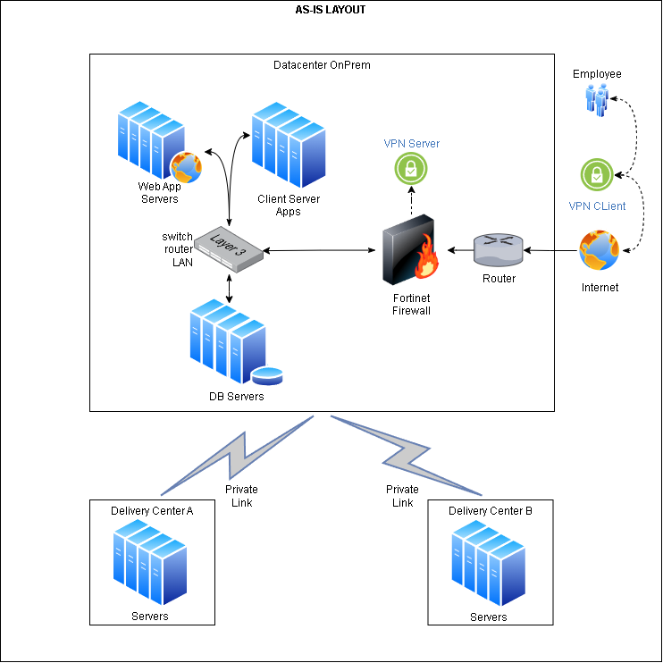
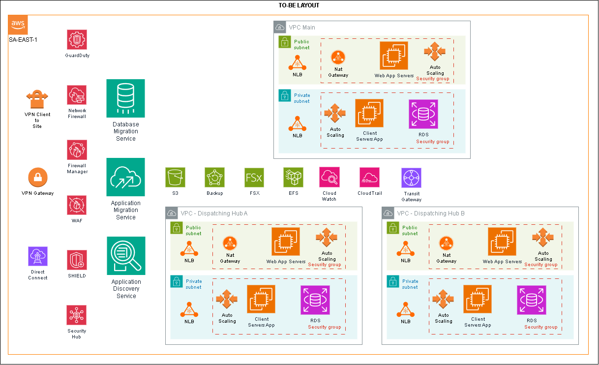

# Case de Migração 
# OnPrem to AWS Cloud
* 30/10/2025  

## Flávio Ottoni

## Descritivo Técnico do Case by Skopia

#### Cenário
Uma empresa com foco no segmento de varejo, deseja migrar o ambiente computacional on-premises para a AWS. A empresa possui um datacenter com aproximadamente 150 servidores, entre Linux e Windows, rodando diversos serviços importantes para a empresa como CRM, sistemas contábeis, sistemas de controle de estoque e de expedição. Estes sistemas rodam as aplicações em ambiente web e cliente/servidor, todas com conexão a algum banco de dados. Além do ambiente corporativo, os usuários internos acessam o ambiente através de VPN, conectado na central da empresa. A empresa também possui dois centros de distribuição que devem ser conectados ao ambiente migrado na nuvem de alguma forma. No ambiente on-premises a empresa utiliza firewalls da Fortinet mas quer melhorar os recursos de segurança e disponibilidade ao ir para a nuvem. Todo o tráfego de entrada e saída para o ambiente requer uma camada de segurança para inspecionar, a fim de controlar o tráfego suspeito. Deve também ter proteção contra possíveis ataques de negação de serviço, injeção de SQL, bem como ter mecanismos de inspeção de tráfego na borda da Internet na AWS. Como um ponto vital dessa arquitetura, devem estar em vigor mecanismos para monitorar a rede, identificar e relatar padrões de ataque, e visualizar a grande maioria dos possíveis eventos de rede na mesma console da AWS para os operadores de rede. O backup é feito via soluções de Veeam, armazenando os dados, parte em storage mais barato e parte em fita.

#### Instruções
Com este cenário, desenhar como será a arquitetura deste ambiente na nuvem AWS, que recursos serão utilizados, que elementos serão considerados na calculadora de custos e como seria um plano macro de migração destes ambientes (dados e sistemas) para a nuvem AWS. Será marcada uma avaliação de 1h para explicar o que foi pedido acima. O desenho pode ser simplificado, o importante será a explicação no momento da entrevista para este teste.

# SOLUÇÃO

## Layout As-is

## Layout To-Be

## Visão Geral da Arquitetura To-Be

### Camada de Rede
* VPC (Virtual Private Cloud) com sub-redes públicas e privadas distribuídas em múltiplas AZs (Availability Zones).
* VPN Site-to-Site para conectar os centros de distribuição e matriz à AWS.
* VPN Client-to-Site para permitir a conexão dos funcionários remotamente
* Transit Gateway para facilitar a comunicação entre múltiplas VPCs e locais remotos.
* NAT Gateway para alcance outbound controlado para as subnets privadas

### Segurança e Inspeção de Tráfego
* AWS Network Firewall para inspeção profunda de pacotes e controle de tráfego.
* AWS Firewall Manager para simplificar a administração centralizada de políticas de segurança, configurar e gerenciar regras do AWS WAF e AWS Network Firewall.
* AWS WAF (Web Application Firewall) para proteção contra SQL Injection, XSS e outros ataques em aplicações web.
* AWS Shield Advanced para mitigação de ataques DDoS.
* Security Groups e NACLs para controle de acesso em nível de instância e sub-rede.
* IAM com políticas granulares para controle de acesso a recursos.

### Monitoramento e Visibilidade
* Amazon GuardDuty para detecção de ameaças e comportamento anômalo.
* AWS CloudTrail para auditoria de ações e chamadas de API.
* Amazon CloudWatch para métricas, logs e alarmes.
* AWS Security Hub como console central de segurança e conformidade.

### Infraestrutura de Servidores
* AWS EC2 para servidores Linux e Windows.
* Utilizar Auto Scaling Groups para aplicações web.
* Elastic Load Balancer (ALB/NLB) para distribuir tráfego.
* AWS RDS para bancos de dados relacionais (SQL Server, MySQL, PostgreSQL).
* AWS FSx for Windows/Linux para compartilhamento de arquivos.
* AWS EFS armazenamento para acesso simultâneo de servidores Linux

### Backup e Armazenamento
* AWS S3 Glacier para armazenamento de backups em fita.
* AWS S3 Standard/IA para dados acessados com menor frequência.
* AWS Backup para orquestrar backups de EC2, RDS, FSx e EFS.

### Ferramentas de Migração
* AWS Database Migration Service para migrar bancos de dados de forma segura, rápida e contínua para a nuvem da AW.
* AWS Application Migration Service (MGN) para migração lift and shift dos servidores Windows e Linux Standalone com a facilidade de automações
* AWS Application Discovery Service como ferramenta de assessment para ajudar a planejar a migração para a nuvem da AWS, coletando dados detalhados sobre os datacenters e servidores locais.

## Elementos para a calculadora de preços AWS

| Categoria             |Exemplos Considerados                          |
|:----------------------|:----------------------------------------------|
| EC2                   | Tipo de instância, horas/mês, licenciamento   |
| RDS                   | Tipo, tamanho, IOPS, backups                  |
| Armazenamento         | EBS, S3, Glacier                              |
| Rede                  | VPN, NAT Gateway, Data Transfer               |
| Segurança             | WAF, Shield, Network Firewall                 |
| Monitoramento         | CloudWatch, GuardDuty, Security Hub           |
| Backup                | AWS Backup                                    |

## Plano (Macro) de Migração

### Etapas:
* Descoberta: Inventário e análise de dependências.
* Planejamento: Classificação por criticidade.
* PoC: Migração de aplicação não crítica.
* Migração por Fases:
    * Fase 1: Aplicações web (back e front)
    * Fase 2: CRM e contabilidade
    * Fase 3: Estoque e expedição
    * Fase 4: Integração com centros de distribuição
* Validação: Testes de segurança, performance e disponibilidade.
* Descomissionamento: Desligamento gradual do datacenter.

## Q&A
#### 1. Como garantir a continuidade dos serviços durante a migração?
A continuidade é garantida por uma abordagem em fases e uso de replicação. Utilizamos ferramentas como AWS Application Migration Service para replicar servidores em tempo real, permitindo testes antes do corte definitivo. Além disso, mantemos sincronização de dados entre ambientes e realizamos migração fora do horário comercial para minimizar impacto.

#### 2. Como lidar com licenciamento de software, especialmente Windows e SQL Server?
Na AWS, temos duas opções: usar instâncias com licenciamento incluído (License Included) ou trazer nossas próprias licenças (BYOL). Para Windows e SQL Server, a AWS oferece instâncias EC2 e RDS com licenças gerenciadas, o que simplifica compliance e suporte. Avaliamos o modelo mais vantajoso com base no inventário atual e custos projetados.

#### 3. Como garantir que os centros de distribuição tenham baixa latência e alta disponibilidade?
Utilizamos VPN Site-to-Site com redundância e AWS Transit Gateway para otimizar rotas. Além disso, podemos aplicar AWS Direct Connect se houver necessidade de latência ultra baixa. A arquitetura em múltiplas AZs garante alta disponibilidade, e o uso de CloudFront pode acelerar o acesso a aplicações web.

#### 4. Como proteger o ambiente contra ataques avançados como DDoS ou SQL Injection?
A proteção é multicamadas: AWS Shield Advanced mitiga DDoS, AWS WAF bloqueia SQL Injection e XSS, e o Network Firewall inspeciona tráfego na borda. GuardDuty detecta comportamentos anômalos, e Security Hub consolida alertas em uma única visão. Tudo isso integrado com CloudWatch para resposta rápida.

#### 5. Como garantir que os custos não saiam do controle após a migração?
Usamos AWS Cost Explorer e Budgets para monitorar gastos em tempo real. A arquitetura foi desenhada com instâncias dimensionadas corretamente, uso de Reserved Instances e armazenamento em camadas (S3 Standard, IA e Glacier). Também aplicamos tags para rastrear custos por projeto ou departamento.

#### 6. Como garantir que os backups sejam confiáveis e estejam disponíveis em caso de desastre?
AWS Backup orquestra backups automáticos de EC2, RDS e FSx. Os dados são armazenados em S3 e Glacier, com replicação entre regiões se necessário.

#### 7. Como lidar com aplicações legadas que não são compatíveis com a nuvem?
Aplicações legadas são avaliadas caso a caso. Podemos usar EC2 com lift-and-shift, ou refatorar para containers com ECS/EKS. Em casos extremos, mantemos parte do ambiente híbrido com AWS Outposts ou VPN para manter conectividade com o datacenter até que a aplicação possa ser modernizada.

#### 8. Como garantir visibilidade e controle centralizado da segurança?
Todos os eventos são integrados ao AWS Security Hub, que centraliza alertas de GuardDuty, WAF, Firewall e CloudTrail. Isso permite que os operadores tenham uma visão única e correlacionada dos riscos, facilitando resposta rápida e auditoria.
